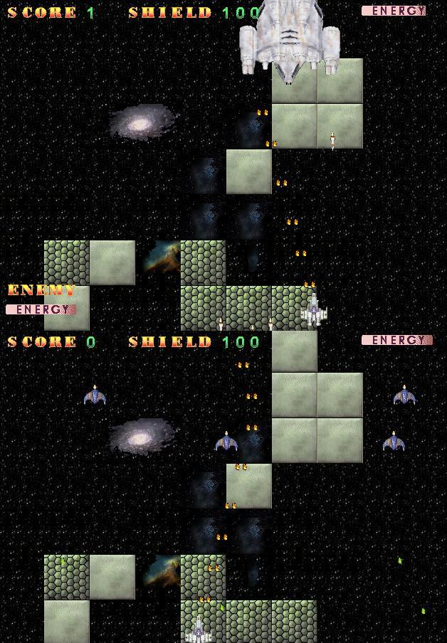



## UVBS  \- Ultimate Shoot EM Up

### Description

New version 2.1, See picture ! Fixed a few bugs and really cleaned up the code. ---

Power-ups, end-of-level badies!! It's now very playable and does not rely on 3rd party DLL's.

If you want sound it does use DXSound 7.0. Please leave feedback. Thanks!
 
### More Info
 
Lots

Works pretty well on my p450

humm

             |
---                |---
**Submitted On**   |2001-11-07 11:59:10
**By**             |[aaron\_morris\_2000](https://github.com/Planet-Source-Code/PSCIndex/blob/master/ByAuthor/aaron-morris-2000.md)
**Level**          |Intermediate
**User Rating**    |4.8 (43 globes from 9 users)
**Compatibility**  |VB 6\.0
**Category**       |[Games](https://github.com/Planet-Source-Code/PSCIndex/blob/master/ByCategory/games__1-38.md)
**World**          |[Visual Basic](https://github.com/Planet-Source-Code/PSCIndex/blob/master/ByWorld/visual-basic.md)
**Archive File**   |[UVBS\_\_\-\_Ul337841172001\.zip](https://github.com/Planet-Source-Code/aaron-morris-2000-uvbs-ultimate-shoot-em-up__1-28684/archive/master.zip)

### API Declarations

See code

